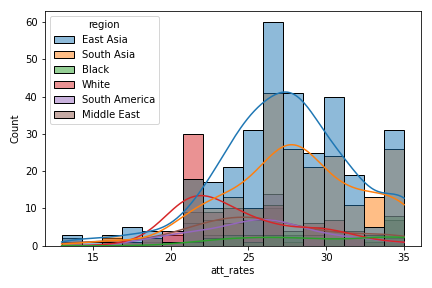

# International Students’ Attitude toward US STEM Education
Opinions of International Students from South Asian, East Asian, "Black" and “White” Countries

# Purpose

The United States has historically been a significant destination for international students. The contribution of international students to universities, such as enhancing diversity, generating revenue, and diversifying cultural perspectives, is widely acknowledged in scholarly literature (Lee 2010; Lee and Rice 2007; Urban and Palmer 2014; Hegarty 2014). However, universities have focused more on attracting international students, while paying little attention to their educational experiences and their opinions on receiving education in their host country after enrollment (Lee 2010; Lee and Rice 2007). Moreover, research has revealed that international students hailing from various countries tend to have divergent experiences within their host institutions. Thus, the analysis aims to reveal the differences in attitudes towards US STEM graduate education between Asian/African countries and “white” countries.

# Data

This is a secondary data of The International STEM Graduate Student Survey conducted in 2015 that aimed to assess multiple aspects of international graduate students in STEM majors in the US including reasons for their decisions of pursuing graduate study in the US, challenges they have experienced during their study, their future career plans and their intention to stay or leave the US after graduation (Han et al. 2015). Han et al (2015) used the combination of purposive and simple random sampling strategies through selecting STEM graduate students from the 10 universities that ranked top in the total number of enrolled international students as their sample group. A total number of 2,322 respondents completed the surveys in which 1,535 of them were domestic students and 787 were international students (ibid.), which were coded separately. I only utilized the data of international students for this analysis. 

The data can be obtained on ICPSR (https://www.icpsr.umich.edu/web/pages/) by searching for the key words, "international students". At the moment of this analysis, this study poped up in the third line of the results.

# Variables

The dependent variable in this analysis is international students’ attitudes towards US STEM graduate education, which was operationalized by the question that asked, “With regard to your academic experience, how would you rate each of the following in comparison with your home country?” (Han et al. 2015). As attitudes can be inferred from people’s experiences (Crano and Prislin 2011), this question regarding academic experiences can be indicators of students attitudes in academic settings. This question was divided into 7 measures that respectively measures their rate regarding open classroom discussions, professors’ teaching styles, subject teaching matter, access to books, magazines, journals, and databases, freedom to openly debate established theories, freedom to pursue new, self-proposed research directions, and collaboration with other graduate students in their lab compared with those in their home countries. All 7 measures are ordinal variables measured as 1=very much worse, 2= worse, 3=the same, 4=better and 5=very much better. The seven measures are analyzed both separately and jointly. To analyze them jointly, I aggregate rates of the seven measures into an additive scale ranging from 13 to 35 in which 13 indicates the worst attitudes while 35 indicates the best. 

The primary independent variable is regions of international students’ nationalities. The respondents were asked in the survey what their home countries are and allowed to choose one nationality from a list of 218 countries. The countries are grouped into 6 regions, East Asia, South Asia, Middle East, South America, White and Black. This is more of a racial-geographical categorization instead of a solely geographical one, considering socio-cultural and racial background can greatly influence international students’ experiences, perceptions and evaluation on the U.S. education they received. 

The control variables are age, gender, level of degree and discipline in this analysis. 

# The Scripts

There are two scripts, data_clean.py and analysis.py, which should be run by this order. 

The first script, data_clean.py, serves to clean the data. The input file are 'int_results.csv' and 'country_list.csv'. 'int_results.csv' is the raw data of survey responses from international students. 'country_list.csv' is the raw data that includes 218 countries, and each of them is assigned with a country code. To clean the data, the script works to trim down the variables into the ones needed for the analysis, change labels of the column names and values into meaningful ones and group the countries into regions by merging the two input files.  

The second script, analysis.py, mainly works to run a factor analysis of the dependent variable, and OLS regression models for statistical analysis. In particular, it generates the Eigenvalue and runs 4 models of OLS regression on the respective independent variables. Model 1 includes only the primary independent variables with the reference of the 'white' category. Model 2 adds the control variable of age with the reference of the '<30' category. Model 3 adds the control variable of gender with the reference of the 'male' category. Model 4 adds the control variable of discipline with the reference of the 'Computer Science' category. Coefficients (Betas) are generated in model 2, 3 and 4 to measure the changes in the independent variables affecting the dependent variable. A catplot figure is generated to present the coefficient differences. 

# Additional files 

1. A README.md provides a description of this project. 
1. 'survey' is the survey used to collect the data. 
1. 'int_results.csv' is the raw data file containing 787 survey results answered by international students. 
1. 'country_list.csv' is the file containing 218 countries respectively assigned with a code.
1. 'data_clean.csv' is the cleaned data generated by the script, data_clean.py. 
1. There are also three folders containing figures generated by the script, analysis.py. The one named 'distribution-of-attitudes' contains figures of accumulated rates of attitudes and individual submeasurements. The one named 'distribution-of-attitudes-by-regions' contains figures of individual submeasurements' distribution by regions. The one named 'distribution-of-control-variables' contains figures of distribution of control variables and the primary independent variable.

# Results and Discussion 

## Participant Composition

, , , , 

Most participants are male aging from 26 to 30 who study engineering, life sciences and computer sciences at PhD level. Most students are from East Aisa (323) and South Aisa (221). Additionally, 89 students are from "White" countries, 73 students are from Middle East, and 27 students are from "Black" countries. 

## Distribution of Students' Rating of U.S. STEM Graduate Education

 

Overall, participants tend to rate higher than lower. The average rates center around 3 to 4. Participants are very satisfied with access to library resources and comparatively less satisfied with freedom to openly debate established theories. 

Surprisingly, students from “Black” countries rate much higher than others across the seven submeasurements. Students from East and South Asia also rate comparatively high. In comparison, students from “White” countries tend to rate lower than others. The high rate of access of library resources gains much contribution from students of "Black" countries, South Asia and Middle East, whereas the low rate of freedom to openly debate established theories is greatly influenced by students of "White" countries and Middle East. 

The sharp rating difference between students from "White" countries and Asian students is clearly reflected in the aggregated rating.

Moreover, regarding professors' teaching styles, the subject matter of instruction, and collaboration with other students, those from East Asia tend to rate lower than their counterparts from South Asia. This difference may be attributed to the divergent sociolinguistic backgrounds between South and East Asian students, as these three aspects are closely linked to interpersonal interactions. Given that the majority of respondents from South Asia hail from India, where English is one of the official languages, it is highly likely that they are adept at navigating English-dominated classes and interpersonal communications. In contrast, language barriers are frequently cited as significant challenges faced by East Asian students.

## OLS Regression Results and Discussion

### Model 1 

    OLS Regression Results                            
    ==============================================================================
    Dep. Variable:              att_rates   R-squared:                       0.073
    Model:                            OLS   Adj. R-squared:                  0.067
    Method:                 Least Squares   F-statistic:                     12.34
    Date:                Tue, 30 Apr 2024   Prob (F-statistic):           1.55e-11
    Time:                        13:38:09   Log-Likelihood:                -2268.6
    No. Observations:                 787   AIC:                             4549.
    Df Residuals:                     781   BIC:                             4577.
    Df Model:                           5                                         
    Covariance Type:            nonrobust                                         
    =================================================================================
                        coef    std err          t      P>|t|      [0.025      0.975]
    ---------------------------------------------------------------------------------
    const            24.3820      0.460     53.024      0.000      23.479      25.285
    South Asia        3.4868      0.545      6.402      0.000       2.418       4.556
    East Asia         3.0112      0.519      5.798      0.000       1.992       4.031
    Middle East       1.4947      0.685      2.182      0.029       0.150       2.839
    Black             5.0624      0.953      5.311      0.000       3.191       6.933
    South America     1.3958      0.748      1.865      0.063      -0.073       2.865
    ==============================================================================
    Omnibus:                        3.663   Durbin-Watson:                   2.049
    Prob(Omnibus):                  0.160   Jarque-Bera (JB):                3.508
    Skew:                          -0.157   Prob(JB):                        0.173
    Kurtosis:                       3.095   Cond. No.                         9.16
    ==============================================================================

### Model 2

    OLS Regression Results                            
    ==============================================================================
    Dep. Variable:              att_rates   R-squared:                       0.078
    Model:                            OLS   Adj. R-squared:                  0.069
    Method:                 Least Squares   F-statistic:                     8.277
    Date:                Tue, 30 Apr 2024   Prob (F-statistic):           8.37e-11
    Time:                        13:38:12   Log-Likelihood:                -2266.3
    No. Observations:                 787   AIC:                             4551.
    Df Residuals:                     778   BIC:                             4593.
    Df Model:                           8                                         
    Covariance Type:            nonrobust                                         
    =================================================================================
                        coef    std err          t      P>|t|      [0.025      0.975]
    ---------------------------------------------------------------------------------
    const            24.4174      0.487     50.159      0.000      23.462      25.373
    South Asia        3.5519      0.546      6.507      0.000       2.480       4.623
    East Asia         3.0404      0.519      5.855      0.000       2.021       4.060
    Middle East       1.5164      0.687      2.206      0.028       0.167       2.866
    Black             4.8975      0.970      5.049      0.000       2.993       6.802
    South America     1.4090      0.749      1.880      0.060      -0.062       2.880
    31-35            -0.3680      0.336     -1.094      0.274      -1.028       0.292
    36-40             0.5607      0.532      1.054      0.292      -0.483       1.605
    41-45             1.2289      1.254      0.980      0.327      -1.233       3.691
    ==============================================================================
    Omnibus:                        3.806   Durbin-Watson:                   2.050
    Prob(Omnibus):                  0.149   Jarque-Bera (JB):                3.673
    Skew:                          -0.163   Prob(JB):                        0.159
    Kurtosis:                       3.073   Cond. No.                         10.2
    ==============================================================================

        Coefficients (Betas):
    const            24.417413
    South Asia        3.551892
    East Asia         3.040368
    Middle East       1.516403
    Black             4.897544
    South America     1.408957
    31-35            -0.367968
    36-40             0.560665
    41-45             1.228933

### Model 3

    OLS Regression Results                            
    ==============================================================================
    Dep. Variable:              att_rates   R-squared:                       0.079
    Model:                            OLS   Adj. R-squared:                  0.067
    Method:                 Least Squares   F-statistic:                     6.684
    Date:                Tue, 30 Apr 2024   Prob (F-statistic):           5.18e-10
    Time:                        13:38:14   Log-Likelihood:                -2266.0
    No. Observations:                 787   AIC:                             4554.
    Df Residuals:                     776   BIC:                             4605.
    Df Model:                          10                                         
    Covariance Type:            nonrobust                                         
    =================================================================================
                        coef    std err          t      P>|t|      [0.025      0.975]
    ---------------------------------------------------------------------------------
    const            24.2948      0.509     47.706      0.000      23.295      25.295
    South Asia        3.5949      0.550      6.541      0.000       2.516       4.674
    East Asia         3.0521      0.520      5.870      0.000       2.031       4.073
    Middle East       1.5257      0.689      2.214      0.027       0.173       2.879
    Black             4.9278      0.971      5.073      0.000       3.021       6.835
    South America     1.4101      0.750      1.880      0.061      -0.063       2.883
    31-35            -0.3731      0.337     -1.108      0.268      -1.034       0.288
    36-40             0.5612      0.532      1.054      0.292      -0.484       1.606
    41-45             1.2744      1.256      1.014      0.311      -1.192       3.741
    female            0.2638      0.325      0.811      0.417      -0.374       0.902
    na                0.4249      1.223      0.347      0.728      -1.976       2.826
    ==============================================================================
    Omnibus:                        3.733   Durbin-Watson:                   2.051
    Prob(Omnibus):                  0.155   Jarque-Bera (JB):                3.593
    Skew:                          -0.161   Prob(JB):                        0.166
    Kurtosis:                       3.079   Cond. No.                         10.7
    ==============================================================================

    Coefficients (Betas):
    const            24.294825
    South Asia        3.594905
    East Asia         3.052077
    Middle East       1.525747
    Black             4.927790
    South America     1.410106
    31-35            -0.373050
    36-40             0.561220
    41-45             1.274438
    female            0.263776
    na                0.424851

### Model 4

    OLS Regression Results                            
    ==============================================================================
    Dep. Variable:              att_rates   R-squared:                       0.100
    Model:                            OLS   Adj. R-squared:                  0.081
    Method:                 Least Squares   F-statistic:                     5.322
    Date:                Tue, 30 Apr 2024   Prob (F-statistic):           8.98e-11
    Time:                        13:38:17   Log-Likelihood:                -2257.2
    No. Observations:                 787   AIC:                             4548.
    Df Residuals:                     770   BIC:                             4628.
    Df Model:                          16                                         
    Covariance Type:            nonrobust                                         
    =====================================================================================
                            coef    std err          t      P>|t|      [0.025      0.975]
    -------------------------------------------------------------------------------------
    const                23.4497      0.645     36.332      0.000      22.183      24.717
    South Asia            3.5748      0.571      6.259      0.000       2.454       4.696
    East Asia             3.0424      0.523      5.814      0.000       2.015       4.070
    Middle East           1.3737      0.693      1.983      0.048       0.014       2.734
    Black                 4.4837      0.997      4.496      0.000       2.526       6.441
    South America         1.2913      0.756      1.707      0.088      -0.194       2.776
    31-35                -0.4514      0.359     -1.258      0.209      -1.156       0.253
    36-40                 0.4942      0.553      0.893      0.372      -0.592       1.580
    41-45                 1.1796      1.258      0.938      0.349      -1.290       3.649
    female                0.0010      0.336      0.003      0.998      -0.659       0.661
    na                    0.4288      1.217      0.352      0.725      -1.959       2.817
    phd                  -0.0613      0.400     -0.153      0.878      -0.847       0.725
    Life Sciences         2.0586      0.571      3.608      0.000       0.939       3.179
    Physical Sciences     0.6466      0.588      1.099      0.272      -0.508       1.801
    Engineering           1.3870      0.461      3.010      0.003       0.482       2.292
    Mathematics           0.7843      0.652      1.203      0.230      -0.496       2.065
    Other                 0.9287      0.705      1.316      0.188      -0.456       2.314
    ==============================================================================
    Omnibus:                        4.090   Durbin-Watson:                   2.040
    Prob(Omnibus):                  0.129   Jarque-Bera (JB):                3.923
    Skew:                          -0.156   Prob(JB):                        0.141
    Kurtosis:                       3.149   Cond. No.                         13.1
    ==============================================================================

    Coefficients (Betas):
    const                23.449742
    South Asia            3.574750
    East Asia             3.042367
    Middle East           1.373708
    Black                 4.483678
    South America         1.291257
    31-35                -0.451426
    36-40                 0.494205
    41-45                 1.179625
    female                0.001029
    na                    0.428818
    phd                  -0.061334
    Life Sciences         2.058589
    Physical Sciences     0.646640
    Engineering           1.387022
    Mathematics           0.784291
    Other                 0.928712

### Coefficient Differences

### Discussion

Model 1 demonstrates that with reference to students of “white” countries, students from middle east rate higher by about 2, those from South and East Asian rate higher by over 3 and those from African countries rate higher by a shocking 5 on a scale of 13 to 35. The region coefficients remain significant in the Model 2, which controls for age, Model 3, which controls for gender, and model 4, level of degree and descipline. Among all control variables, only the major of Engineering and Life sciences are statistically significant predictors. With reference to students majoring in computer science, being in majors of Engineering and Life sciences increases the rate of attitudes by 1.4 and 2. 

This result is contrary to what was hypothesized based on previous research where negative experiences such as barriers in making friends with domestic students (Zhou and Cole 2017), being engaged in cultural resources (Urban and Palmer 2014), interaction with domestic students (Ma 2020) and experiences of discrimination (Lee and Rice 2007) are constantly reported by Asian and Black international students. One possible reason for this result could be the specific focus on academic experiences instead of social experiences informed by the measuring model question in this analysis. This possibly indicates that Asian and African international students are more likely to be satisfied with their STEM graduate education in the US regarding their academic experiences. 

Another potential explanation is that international students from Asian and African countries may feel disempowered to offer criticism of US education compared to those from "white" countries. This may be due in part to the increased levels of discrimination that Asian and African international students experience (Hanassab 2006; Lee and Rice 2007), less social support (Mallinckrodt and Leong 1992) and hightened stress in academic settings (Alharbi and Smith 2018), these factors suggest that international students from Asian and African countries may face marginalization and be hesitant to voice negative evaluations of their education.

                               

